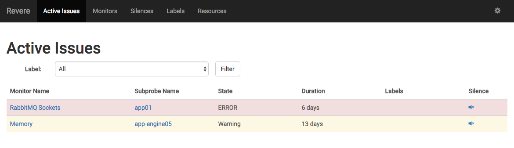

# Revere
“One if by land, and two if by sea”

An alerting system built on Go for medium-sized microservice architectures, designed for high extensibility and reusability. Currently supports Graphite as a data source, with others in the works.

--
Version history:

* `0.5.0` Revere first open sourced.

## Why Revere?
* Revere was built to be extensible and flexible. You can easily fit it to your architecture.
* Open source means Revere will grow to the community's needs.
* Threshold-based email alerting means you won't have to stare at graphs constantly.

## Quick Start

### Dependencies

MySQL is required for Revere - you should make sure that's working on your machine first. Then, create a database.

### Get Revere

This section walks through getting Revere up and creating a basic monitor.

First, get Revere by downloading the binary from the latest release.

Revere has two arguments on the command line:

		revere [-conf env.json] [-mode mode]

### Configuration

Now, create a configuration file following the specification in the example below.

**Example config file:** `example.json`

		{
			"DB": {
				"DSN": "mysql://<username>:<password>@<host>:<port>/<database>"
				"TablePrefix": "<database>.<tablePrefix>"
			},
			"Port": 1234
		}

### Mode

Next, we will run Revere with its `initdb` mode flag. This automatically generates the database tables that Revere will use.

		revere -conf example.json -mode initdb

Now we are ready to run Revere in it's default daemon and UI mode.

		revere -conf example.json

Now that Revere is running, navigate to the Resources page. Add the graphite URL to query as a new entry. In addition, go to settings (the gear on the upper right) and enter in your desired email settings.

Next, navigate to the Monitors page, and click `+new` to create a new monitor. Fill in the Name, Owner, Description, Alert response, and graphite expression. Set the thresholds, and configure how often that Revere will check for the error. From this screen, you can use the Preview Period area to generate a relevant graph to make sure the monitor is configured correctly.

Finally, add a trigger and an email for this monitor to alert when the state changes. Click save. You have successfully configured your first monitor! Happy alerting. If your monitor has been added correctly, you should see a line on your Active Issues page when an alert threshold is reached, like this: 

## Revere Concepts

Detailed explanations of concepts behind Revere.

### States
Revere considers monitored services to be in one of five states.

**`Normal`** - things are operating as expected.

**`Warning`** - something odd is happening. People who are involved in this service should know about it, but others should not be notified.

**`Error`** - something is broken. People will be notified so they can take steps to resolve the problem.

**`Critical`** - there is a serious problem. This may warrant waking people up to resolve the issue as soon as possible.

**`Unknown`** - there is an error in checking the health of a service.

--

### Probes
Probes are the mechanism through which Revere simplifies the real world into one of the five states. They generate a stream of states over time.

#### Subprobes
Probes can contain multiple streams, with each stream associated with a separate string identifier. This makes it easy to represent infrastructure monitoring more generically. As an example, at Yext, we only need to use a single probe to keep track of every backend server behind our HAProxy load balancer via the automatically generated subprobes.

#### Graphite Threshold Probe
This first release of Revere comes with a single probe type: the Graphite threshold probe.

This probe looks at a set of data from Graphite and determines the state by whether recent values have been above or below a specified threshold for a certain amount of time.

--

### Triggers

Triggers are listeners that can be placed on monitors or labels. A trigger will cause an alert to be sent to a specified target, and can be configured to send only at a certain error level.

--

### Targets

Targets are places where Revere can send alerts. This first release of Revere comes with a single target type: email. Email targets consist of to/reply-to email address pairs. If no reply-to address is specified, the same address for both fields.

--

### Monitors

Monitors tie probes to triggers and store common metadata.

Metadata format:
* short name (at most 30 characters) for use in alerts and other UI
* description of what is monitored by this monitor
* tips for what steps to take if this monitor sends an alert
* contact information of owner

Monitors store information that define what to do when probes becomes not **`Normal`**:
* Configuration for targets
* Level that causes the trigger to alert
* Minimum time between repeated alerts
* Whether an alert should be pushed for de-escalation
* Optional regular expression to match against subprobe names

--

### Silences

Silences allow suppression of alerts on known problems, and operate on monitors. Silences apply to a particular monitor and may not extend more than 2 weeks into the future. Silences may also be created in the future, in anticipation of alerts.

When silences are in effect, the triggers operate as if the subprobe is in the **`Normal`** state. This means there will be a de-escalation alert if the subprobe was already in a triggered state at the start of the silence.

--

### Labels

Labels group related monitors to simplify browsing, and also allow for standardized triggers to be applied to a set of monitors.

They store:
* short name
* description
* a set of triggers sans subprobe filters

Labels can be applied to only a subset of subprobes in a monitor via a regular expression filter.

### Mode Flag

--

Revere's mode flag `-mode` that change its run behavior. Currently, the flags available are `initdb`, `daemon`, and `web`.

`initdb`: Revere will automatically initialize its database storage. When run in this mode, Revere will either create a new storage area from scratch, or updating any existing Revere tables to the latest schema. This mode must be run by itself.

`daemon`: Revere runs as a daemon that monitors systems and generates alerts.

`web`: Revere serves the HTTP UI for administering Revere and viewing its current state.

By default, the `-mode` flag defaults to `daemon` and `web`.

